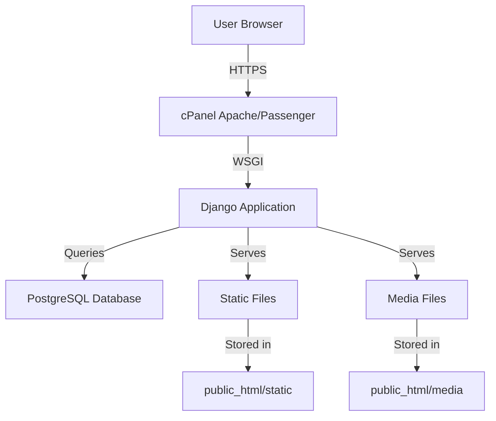

# Hawladar Agro - Django Deployment Plan

## Project Overview

**Project Name:** Hawladar Agro - Project Amar (Cow Hotel Investment Platform)
**Target Domain:** hawladaragro.farm
**Current Status:** Django 5.0.1 project in development
**Hosting:** cPanel with SSH access enabled
**Primary Domain:** kalobiral.com.bd
**Add-on Domain:** hawladaragro.farm

---

## Table of Contents

1. [Pre-Deployment Checklist](#pre-deployment-checklist)
2. [WordPress Site Backup](#wordpress-site-backup)
3. [Project Reorganization](#project-reorganization)
4. [Configuration Updates](#configuration-updates)
5. [cPanel Deployment](#cpanel-deployment)
6. [Post-Deployment Verification](#post-deployment-verification)
7. [Rollback Procedures](#rollback-procedures)

---

## Pre-Deployment Checklist

### Current Project Structure Analysis

```
hawladarAgro_portfolio/
├── .env.example
├── .gitignore (TO BE CREATED)
├── db.sqlite3
├── manage.py
├── README.md
├── requirements.txt
├── hawladar_agro/
│   ├── __init__.py
│   ├── asgi.py
│   ├── settings.py
│   ├── urls.py
│   └── wsgi.py
├── portfolio/
│   ├── __init__.py
│   ├── admin.py
│   ├── apps.py
│   ├── migrations/
│   ├── models.py
│   ├── tests.py
│   ├── urls.py
│   └── views.py
├── portfolio/templates/
│   ├── base.html
│   └── portfolio/
│       ├── about.html
│       ├── blog_detail.html
│       ├── blog_list.html
│       ├── contact.html
│       ├── gallery.html
│       ├── home.html
│       ├── home_old.html (TO BE REMOVED)
│       ├── investment.html
│       ├── project_detail.html
│       ├── project_list.html
│       └── team_list.html
├── static/
│   ├── css/
│   │   ├── custom-sections.css
│   │   └── styles.css
│   ├── images/
│   │   ├── icons/
│   │   │   ├── halal.png
│   │   │   ├── monitor.png
│   │   │   └── profit.png
│   │   ├── farm_cow.png
│   │   ├── farm_overview.png
│   │   ├── logo.jpg
│   │   ├── logo.png
│   │   ├── map.png
│   │   ├── our_expert.png
│   │   ├── owner_with_cattle_1.png
│   │   ├── owner_with_cattle_2.png
│   │   ├── owner_with_cattle_3.png
│   │   ├── Untitled.png (TO BE REMOVED)
│   │   └── Whisk_hero.gif (TO BE REVIEWED)
│   └── js/
│       └── script.js
└── plans/
    ├── dummy.md (TO BE REMOVED)
    ├── portfolio-improvement-plan.md
    ├── ui-ux-audit-report.md
    ├── ui-ux-implementation-plan.md
    └── ui-ux-implementation-plan-part2.md
```

### Files to Remove (Redundant/Unnecessary)

| File | Reason |
|------|--------|
| `portfolio/templates/portfolio/home_old.html` | Old backup version, not needed in git |
| `static/images/Untitled.png` | Untitled placeholder, not used |
| `static/images/Whisk_hero.gif` | Appears to be unrelated content (Whisk brand) |
| `plans/dummy.md` | Dummy/test file |
| `convert_pdf_to_images.py` | Temporary utility script |
| `convert_pdf_to_image.py` | Duplicate utility script |
| `pdf_images/` | Temporary conversion output directory |
| `screencapture-converted.png` | Temporary conversion output |
| `screencapture-secure-balancedserver-2083-cpsess0380042435-frontend-jupiter-index-html-2026-03-02-23_37_23.pdf` | cPanel screenshot, not project content |
| `Bilingual Project Amar Website Content.pdf` | Content reference, should be documented separately |
| `Screenshot 2026-03-03 235054.jpg` | Screenshot, not project content |
| `Untitled.png` | Untitled screenshot |

### Files to Keep (Documentation/Reference)

| File | Reason |
|------|--------|
| `plans/portfolio-improvement-plan.md` | Project planning documentation |
| `plans/ui-ux-audit-report.md` | UX audit documentation |
| `plans/ui-ux-implementation-plan.md` | Implementation plan |
| `plans/ui-ux-implementation-plan-part2.md` | Implementation plan part 2 |

---

## WordPress Site Backup

### Backup Strategy

Before deploying the Django site, we must create a complete backup of the existing WordPress site at `hawladaragro.farm`.

### Backup Steps via SSH

1. **Connect to cPanel via SSH:**
   ```bash
   ssh kalobira@kalobiral.com.bd -p 2083
   # Or use the private key if configured
   ```

2. **Navigate to the WordPress directory:**
   ```bash
   cd public_html/hawladaragro.farm
   # OR
   cd public_html
   ```

3. **Create backup directory:**
   ```bash
   mkdir -p ~/backups/wordpress_$(date +%Y%m%d_%H%M%S)
   BACKUP_DIR=~/backups/wordpress_$(date +%Y%m%d_%H%M%S)
   ```

4. **Backup WordPress files:**
   ```bash
   tar -czf $BACKUP_DIR/wordpress_files.tar.gz public_html/
   ```

5. **Backup MySQL database:**
   ```bash
   # Get database credentials from wp-config.php
   grep DB_NAME wp-config.php
   grep DB_USER wp-config.php
   grep DB_PASSWORD wp-config.php

   # Export database
   mysqldump -u DB_USER -pDB_PASSWORD DB_NAME > $BACKUP_DIR/wordpress_database.sql
   ```

6. **Create backup manifest:**
   ```bash
   cat > $BACKUP_DIR/backup_manifest.txt << EOF
   Backup Date: $(date)
   Domain: hawladaragro.farm
   Files: wordpress_files.tar.gz
   Database: wordpress_database.sql
   Size: $(du -sh $BACKUP_DIR | cut -f1)
   EOF
   ```

### Backup Verification

```bash
# Verify backup integrity
ls -lh $BACKUP_DIR/
tar -tzf $BACKUP_DIR/wordpress_files.tar.gz | head -20
head -20 $BACKUP_DIR/wordpress_database.sql
```

### Rollback Procedure (If Needed)

```bash
# Restore WordPress files
tar -xzf ~/backups/wordpress_DATE/wordpress_files.tar.gz -C ~/

# Restore database
mysql -u DB_USER -pDB_PASSWORD DB_NAME < ~/backups/wordpress_DATE/wordpress_database.sql
```

---

## Project Reorganization

### 1. Create .gitignore File

```gitignore
# Python
__pycache__/
*.py[cod]
*$py.class
*.so
.Python
build/
develop-eggs/
dist/
downloads/
eggs/
.eggs/
lib/
lib64/
parts/
sdist/
var/
wheels/
*.egg-info/
.installed.cfg
*.egg

# Django
*.log
local_settings.py
db.sqlite3
db.sqlite3-journal
/media/
/staticfiles/
/static/

# Environment
.env
.venv
env/
venv/
ENV/
env.bak/
venv.bak/

# IDE
.vscode/
.idea/
*.swp
*.swo
*~

# OS
.DS_Store
Thumbs.db

# Temporary files
*.tmp
*.temp
pdf_images/
screencapture-*.png
screencapture-*.pdf
convert_*.py

# Screenshots
Screenshot*.jpg
Screenshot*.png
Untitled.png
Untitled.jpg

# Documentation PDFs (keep in docs/ if needed)
*.pdf
```

### 2. Directory Structure for Production

```
hawladarAgro_portfolio/
├── .env                    # Environment variables (NOT in git)
├── .env.example            # Template for environment variables
├── .gitignore              # Git ignore rules
├── manage.py               # Django management script
├── requirements.txt        # Python dependencies
├── requirements-prod.txt   # Production-specific dependencies
├── README.md               # Project documentation
├── DEPLOYMENT.md           # This deployment guide
├── hawladar_agro/
│   ├── __init__.py
│   ├── asgi.py
│   ├── settings.py        # Base settings
│   ├── settings_dev.py    # Development settings
│   ├── settings_prod.py   # Production settings
│   ├── urls.py
│   └── wsgi.py
├── portfolio/
│   ├── __init__.py
│   ├── admin.py
│   ├── apps.py
│   ├── migrations/
│   ├── models.py
│   ├── tests.py
│   ├── urls.py
│   └── views.py
├── portfolio/templates/
│   ├── base.html
│   └── portfolio/
│       ├── about.html
│       ├── blog_detail.html
│       ├── blog_list.html
│       ├── contact.html
│       ├── gallery.html
│       ├── home.html
│       ├── investment.html
│       ├── project_detail.html
│       ├── project_list.html
│       └── team_list.html
├── static/
│   ├── css/
│   │   ├── custom-sections.css
│   │   └── styles.css
│   ├── images/
│   │   ├── icons/
│   │   │   ├── halal.png
│   │   │   ├── monitor.png
│   │   │   └── profit.png
│   │   ├── farm_cow.png
│   │   ├── farm_overview.png
│   │   ├── logo.jpg
│   │   ├── logo.png
│   │   ├── map.png
│   │   ├── our_expert.png
│   │   ├── owner_with_cattle_1.png
│   │   ├── owner_with_cattle_2.png
│   │   └── owner_with_cattle_3.png
│   └── js/
│       └── script.js
├── media/                  # User uploaded files (created by Django)
├── docs/                   # Documentation
│   ├── Bilingual Project Amar Website Content.pdf
│   └── cpanel-screenshot.pdf
└── plans/                  # Project planning documents
    ├── portfolio-improvement-plan.md
    ├── ui-ux-audit-report.md
    ├── ui-ux-implementation-plan.md
    └── ui-ux-implementation-plan-part2.md
```

---

## Configuration Updates

### 1. Split Settings into Dev/Prod

#### hawladar_agro/settings.py (Base Settings)
```python
"""
Base Django settings for hawladar_agro project.
"""
from pathlib import Path
import environ

BASE_DIR = Path(__file__).resolve().parent.parent

# Initialize environment variables
env = environ.Env()

# Read .env file
environ.Env.read_env(BASE_DIR / '.env')

SECRET_KEY = env('SECRET_KEY', default='django-insecure-dev-key-change-for-production')

INSTALLED_APPS = [
    'django.contrib.admin',
    'django.contrib.auth',
    'django.contrib.contenttypes',
    'django.contrib.sessions',
    'django.contrib.messages',
    'django.contrib.staticfiles',
    'rest_framework',
    'portfolio',
]

MIDDLEWARE = [
    'django.middleware.security.SecurityMiddleware',
    'django.contrib.sessions.middleware.SessionMiddleware',
    'django.middleware.common.CommonMiddleware',
    'django.middleware.csrf.CsrfViewMiddleware',
    'django.contrib.auth.middleware.AuthenticationMiddleware',
    'django.contrib.messages.middleware.MessageMiddleware',
    'django.middleware.clickjacking.XFrameOptionsMiddleware',
]

ROOT_URLCONF = 'hawladar_agro.urls'

TEMPLATES = [
    {
        'BACKEND': 'django.template.backends.django.DjangoTemplates',
        'DIRS': [],
        'APP_DIRS': True,
        'OPTIONS': {
            'context_processors': [
                'django.template.context_processors.debug',
                'django.template.context_processors.request',
                'django.contrib.auth.context_processors.auth',
                'django.contrib.messages.context_processors.messages',
            ],
            'builtins': [
                'django.templatetags.static',
            ],
        },
    },
]

WSGI_APPLICATION = 'hawladar_agro.wsgi.application'

AUTH_PASSWORD_VALIDATORS = [
    {
        'NAME': 'django.contrib.auth.password_validation.UserAttributeSimilarityValidator',
    },
    {
        'NAME': 'django.contrib.auth.password_validation.MinimumLengthValidator',
    },
    {
        'NAME': 'django.contrib.auth.password_validation.CommonPasswordValidator',
    },
    {
        'NAME': 'django.contrib.auth.password_validation.NumericPasswordValidator',
    },
]

LANGUAGE_CODE = 'bn-bd'
TIME_ZONE = 'Asia/Dhaka'
USE_I18N = True
USE_TZ = True

STATIC_URL = '/static/'
MEDIA_URL = '/media/'

DEFAULT_AUTO_FIELD = 'django.db.models.BigAutoField'
```

#### hawladar_agro/settings_dev.py (Development)
```python
from .settings import *

DEBUG = True

ALLOWED_HOSTS = ['localhost', '127.0.0.1']

DATABASES = {
    'default': {
        'ENGINE': 'django.db.backends.sqlite3',
        'NAME': BASE_DIR / 'db.sqlite3',
    }
}

STATICFILES_DIRS = [
    BASE_DIR / 'static',
]

STATIC_ROOT = BASE_DIR / 'staticfiles'
MEDIA_ROOT = BASE_DIR / 'media'
```

#### hawladar_agro/settings_prod.py (Production)
```python
from .settings import *
import os

DEBUG = False

ALLOWED_HOSTS = env.list('ALLOWED_HOSTS', default=['hawladaragro.farm', 'www.hawladaragro.farm'])

# Database - PostgreSQL for production
DATABASES = {
    'default': {
        'ENGINE': 'django.db.backends.postgresql',
        'NAME': env('DB_NAME'),
        'USER': env('DB_USER'),
        'PASSWORD': env('DB_PASSWORD'),
        'HOST': env('DB_HOST', default='localhost'),
        'PORT': env('DB_PORT', default='5432'),
    }
}

STATIC_ROOT = BASE_DIR / 'public_html' / 'static'
MEDIA_ROOT = BASE_DIR / 'public_html' / 'media'

# Security settings
SECURE_BROWSER_XSS_FILTER = True
SECURE_CONTENT_TYPE_NOSNIFF = True
SECURE_HSTS_SECONDS = 31536000
SECURE_HSTS_INCLUDE_SUBDOMAINS = True
SECURE_HSTS_PRELOAD = True
SESSION_COOKIE_SECURE = True
CSRF_COOKIE_SECURE = True

# SSL/HTTPS
SECURE_SSL_REDIRECT = True

# Email configuration
EMAIL_BACKEND = 'django.core.mail.backends.smtp.EmailBackend'
EMAIL_HOST = env('EMAIL_HOST')
EMAIL_PORT = env('EMAIL_PORT', default=587)
EMAIL_USE_TLS = True
EMAIL_HOST_USER = env('EMAIL_HOST_USER')
EMAIL_HOST_PASSWORD = env('EMAIL_HOST_PASSWORD')
DEFAULT_FROM_EMAIL = env('DEFAULT_FROM_EMAIL')

# Logging
LOGGING = {
    'version': 1,
    'disable_existing_loggers': False,
    'handlers': {
        'file': {
            'level': 'WARNING',
            'class': 'logging.FileHandler',
            'filename': BASE_DIR / 'logs' / 'django.log',
        },
    },
    'loggers': {
        'django': {
            'handlers': ['file'],
            'level': 'WARNING',
            'propagate': True,
        },
    },
}
```

### 2. Update .env.example

```bash
# Django Environment Variables
# Copy this file to .env and fill in your actual values

# SECURITY WARNING: keep the secret key used in production secret!
SECRET_KEY=your-secret-key-here

# DEBUG mode - Set to False in production
DEBUG=True

# ALLOWED_HOSTS - Comma-separated list of allowed hostnames
ALLOWED_HOSTS=localhost,127.0.0.1

# Database Configuration (Production)
DB_NAME=hawladaragro_db
DB_USER=hawladaragro_user
DB_PASSWORD=your-db-password
DB_HOST=localhost
DB_PORT=5432

# Email Configuration
EMAIL_HOST=smtp.gmail.com
EMAIL_PORT=587
EMAIL_HOST_USER=your-email@gmail.com
EMAIL_HOST_PASSWORD=your-app-password
DEFAULT_FROM_EMAIL=noreply@hawladaragro.farm
```

### 3. Create WSGI Configuration for cPanel

#### passenger_wsgi.py (for Passenger on cPanel)
```python
import os
import sys

# Set the path to your project
project_path = '/home/kalobira/hawladaragro.farm'
if project_path not in sys.path:
    sys.path.insert(0, project_path)

# Set Django settings module
os.environ.setdefault('DJANGO_SETTINGS_MODULE', 'hawladar_agro.settings_prod')

# Import Django and set up WSGI application
import django
from django.core.wsgi import get_wsgi_application

django.setup()
application = get_wsgi_application()
```

### 4. Update requirements.txt

```txt
Django==5.0.1
djangorestframework==3.14.0
psycopg2-binary==2.9.9
Pillow==10.2.0
django-environ==0.11.2
```

### 5. Create requirements-prod.txt

```txt
-r requirements.txt
gunicorn==21.2.0
whitenoise==6.6.0
```

---

## cPanel Deployment

### Deployment Architecture



### Deployment Steps

#### Step 1: Prepare Local Project

```bash
# 1. Create virtual environment
python -m venv venv
source venv/bin/activate  # On Windows: venv\Scripts\activate

# 2. Install dependencies
pip install -r requirements.txt

# 3. Run migrations
python manage.py makemigrations
python manage.py migrate

# 4. Create superuser
python manage.py createsuperuser

# 5. Collect static files (for testing)
python manage.py collectstatic

# 6. Test locally
python manage.py runserver
```

#### Step 2: Set Up PostgreSQL Database on cPanel

1. **Create Database via cPanel:**
   - Login to cPanel
   - Go to "Databases" → "PostgreSQL Databases"
   - Create new database: `hawladaragro_db`
   - Create new user: `hawladaragro_user`
   - Add user to database with all privileges

2. **Note connection details:**
   - Database name
   - Username
   - Password
   - Host (usually `localhost`)

#### Step 3: Upload Project to cPanel

**Option A: Using Git (Recommended)**

```bash
# On cPanel server via SSH
cd ~/
git clone https://your-repo-url.git hawladaragro.farm

# Or if pushing to server
# On local machine
git remote add production ssh://kalobira@kalobiral.com.bd:2083/home/kalobira/hawladaragro.farm
git push production main
```

**Option B: Using SFTP/FTP**

```bash
# Use FileZilla or similar SFTP client
# Upload all project files to /home/kalobira/hawladaragro.farm
```

#### Step 4: Set Up Python Environment on cPanel

```bash
# SSH into cPanel
ssh kalobira@kalobiral.com.bd

# Create virtual environment
cd ~/hawladaragro.farm
python3 -m venv venv

# Activate virtual environment
source venv/bin/activate

# Install dependencies
pip install -r requirements.txt
```

#### Step 5: Configure Environment Variables

```bash
# Create .env file
cd ~/hawladaragro.farm
nano .env

# Add production values
SECRET_KEY=generate-strong-secret-key
DEBUG=False
ALLOWED_HOSTS=hawladaragro.farm,www.hawladaragro.farm
DB_NAME=hawladaragro_db
DB_USER=hawladaragro_user
DB_PASSWORD=your-db-password
DB_HOST=localhost
DB_PORT=5432
```

#### Step 6: Run Migrations

```bash
cd ~/hawladaragro.farm
source venv/bin/activate
python manage.py migrate --settings=hawladar_agro.settings_prod
```

#### Step 7: Collect Static Files

```bash
python manage.py collectstatic --settings=hawladar_agro.settings_prod --noinput
```

#### Step 8: Configure cPanel for Django

**Using Python Application Manager (if available):**

1. Go to cPanel → "Software" → "Setup Python App"
2. Create new application:
   - Python version: 3.11 or higher
   - Application root: `hawladaragro.farm`
   - Application URL: `hawladaragro.farm`
   - Application startup file: `passenger_wsgi.py`
   - Application entry point: `application`

**Using .htaccess (Alternative):**

```apache
# In public_html/.htaccess
RewriteEngine On
RewriteCond %{REQUEST_FILENAME} !-f
RewriteCond %{REQUEST_FILENAME} !-d
RewriteRule ^(.*)$ /passenger_wsgi.py/$1 [QSA,L]
```

#### Step 9: Configure Domain

1. Go to cPanel → "Domains"
2. Select `hawladaragro.farm`
3. Set document root to: `/home/kalobira/hawladaragro.farm/public_html`

#### Step 10: SSL Configuration

1. Go to cPanel → "Security" → "SSL/TLS"
2. Install Let's Encrypt certificate for `hawladaragro.farm`
3. Enable "Force HTTPS Redirect"

---

## Post-Deployment Verification

### Verification Checklist

- [ ] Homepage loads correctly at `https://hawladaragro.farm`
- [ ] All static files (CSS, JS, images) are loading
- [ ] Media files are accessible
- [ ] Admin panel is accessible at `/admin`
- [ ] All pages are accessible (Home, About, Projects, Blog, Team, Gallery, Contact, Investment)
- [ ] Forms are working (Contact form)
- [ ] Database connections are working
- [ ] No errors in error logs
- [ ] SSL certificate is valid and HTTPS is working
- [ ] Site is responsive on mobile devices

### Log Monitoring

```bash
# View Django logs
tail -f ~/hawladaragro.farm/logs/django.log

# View Apache error logs
tail -f ~/logs/error_log

# View Passenger logs
tail -f ~/logs/passenger.log
```

### Performance Testing

- Test page load speed using GTmetrix or PageSpeed Insights
- Verify all images are optimized
- Check for any console errors in browser developer tools

---

## Rollback Procedures

### Scenario 1: Django Deployment Issues

```bash
# SSH into cPanel
ssh kalobira@kalobiral.com.bd

# Stop the Django application
cd ~/hawladaragro.farm
touch tmp/restart.txt  # For Passenger

# Restore WordPress backup
cd ~/
tar -xzf backups/wordpress_DATE/wordpress_files.tar.gz
mysql -u DB_USER -pDB_PASSWORD DB_NAME < backups/wordpress_DATE/wordpress_database.sql

# Update domain document root back to WordPress
# Via cPanel: Domains → hawladaragro.farm → Modify Document Root
```

### Scenario 2: Database Issues

```bash
# Restore database from backup
mysql -u DB_USER -pDB_PASSWORD DB_NAME < backups/wordpress_DATE/wordpress_database.sql

# Or restore Django database
python manage.py migrate --settings=hawladar_agro.settings_prod --fake-initial
```

### Scenario 3: Complete Site Down

```bash
# Emergency: Restore entire WordPress site
cd ~/
tar -xzf backups/wordpress_DATE/wordpress_files.tar.gz
mysql -u DB_USER -pDB_PASSWORD DB_NAME < backups/wordpress_DATE/wordpress_database.sql

# Contact hosting provider if needed
```

---

## Development Workflow

### Local Development Setup

```bash
# 1. Activate virtual environment
source venv/bin/activate

# 2. Set DJANGO_SETTINGS_MODULE
export DJANGO_SETTINGS_MODULE=hawladar_agro.settings_dev

# 3. Run development server
python manage.py runserver

# 4. Create migrations
python manage.py makemigrations

# 5. Apply migrations
python manage.py migrate

# 6. Collect static (for testing)
python manage.py collectstatic --noinput
```

### Git Workflow

```bash
# 1. Create feature branch
git checkout -b feature/new-feature

# 2. Make changes and commit
git add .
git commit -m "Add new feature"

# 3. Push to remote
git push origin feature/new-feature

# 4. Merge to main after review
git checkout main
git merge feature/new-feature

# 5. Deploy to production
git push production main
```

---

## Security Checklist

- [ ] Strong SECRET_KEY generated and stored securely
- [ ] DEBUG = False in production
- [ ] ALLOWED_HOSTS properly configured
- [ ] SSL/HTTPS enabled and enforced
- [ ] Database credentials are strong
- [ ] .env file is not accessible via web
- [ ] Admin panel has strong password
- [ ] Regular backups are scheduled
- [ ] Security headers are configured
- [ ] File permissions are correct (644 for files, 755 for directories)

---

## Maintenance Tasks

### Regular Tasks

- **Daily:** Check error logs
- **Weekly:** Review site performance
- **Monthly:** Update dependencies, create database backups
- **Quarterly:** Security audit, SSL certificate renewal

### Update Dependencies

```bash
# On local machine
pip list --outdated
pip install --upgrade package-name
pip freeze > requirements.txt

# On production server
cd ~/hawladaragro.farm
source venv/bin/activate
pip install -r requirements.txt
touch tmp/restart.txt
```

---

## Contact Information

**Domain:** hawladaragro.farm
**cPanel User:** kalobira
**Primary Domain:** kalobiral.com.bd
**SSH Access:** Enabled (RSA 2048 key)

---

## Appendix

### Useful Commands

```bash
# Generate secret key
python -c "from django.core.management.utils import get_random_secret_key; print(get_random_secret_key())"

# Check Python version
python --version

# Check Django version
python -m django --version

# Check PostgreSQL version
psql --version

# View disk usage
df -h

# View directory size
du -sh directory_name
```

### cPanel Paths

- Home directory: `/home/kalobira`
- Public HTML: `/home/kalobira/public_html`
- Logs: `/home/kalobira/logs/`
- Backups: `/home/kalobira/backups/`

---

*Document Version: 1.0*
*Last Updated: 2026-03-04*
